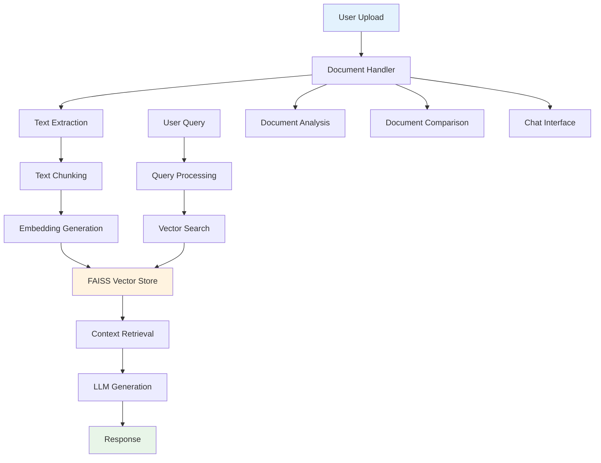

# Document Portal System 🚀

A powerful, intelligent document analysis and comparison system built with FastAPI, LangChain, and FAISS. Transform your documents into searchable, analyzable knowledge bases with AI-powered insights.

## 🌟 Features

### 📄 **Document Processing**
- **Multi-format Support**: PDF, DOCX, TXT files
- **Intelligent Text Extraction**: Advanced parsing with PyMuPDF and docx2txt
- **Smart Chunking**: Recursive text splitting for optimal processing
- **Session Management**: Organized document handling with unique session IDs

### 🤖 **AI-Powered Analysis**
- **Document Analysis**: Extract key insights and summarize content
- **Document Comparison**: Compare multiple documents for similarities and differences
- **Intelligent Chat**: Conversational RAG (Retrieval-Augmented Generation) with your documents
- **Multi-document Search**: Query across entire document collections

### 🔍 **Advanced Retrieval**
- **Vector Search**: FAISS-based semantic search
- **Context-Aware Responses**: Intelligent context retrieval and generation
- **Conversational Memory**: Maintain chat history for coherent conversations
- **Real-time Indexing**: Dynamic document indexing and updates

### 🏗️ **Robust Architecture**
- **FastAPI Backend**: High-performance REST API
- **Modular Design**: Clean separation of concerns
- **Exception Handling**: Comprehensive error management
- **Logging System**: Structured logging with structlog
- **Docker Support**: Containerized deployment ready

## 🚀 Quick Start

### Prerequisites
- Python 3.10+
- Git
- Docker (optional)

### Installation

```bash
# Clone the repository
git clone <your-repo-url>
cd document_portal

# Create virtual environment
python -m venv venv

# Activate environment
# Windows
venv\Scripts\activate
# macOS/Linux
source venv/bin/activate

# Install dependencies
pip install -r requirements.txt

# Run the application
uvicorn api.main:app --reload --host 0.0.0.0 --port 8080
```

### Docker Deployment

```bash
# Build and run with Docker
docker build -t document_portal .
docker run -p 8080:8080 document_portal
```

## 🏗️ System Architecture



## 📚 Core Components

### 1. **Document Ingestion** (`src/document_ingestion/`)
- **DocHandler**: Manages file uploads and storage
- **ChatIngestor**: Handles document indexing for chat functionality
- **FAISS Manager**: Vector database management and optimization

### 2. **Document Analysis** (`src/document_analyzer/`)
- **DocumentAnalyzer**: AI-powered document analysis and insights
- **Text Processing**: Advanced text extraction and cleaning
- **Content Summarization**: Intelligent document summarization

### 3. **Document Comparison** (`src/document_compare/`)
- **DocumentComparator**: Compare multiple documents
- **Similarity Analysis**: Find commonalities and differences
- **Structured Output**: Tabular comparison results

### 4. **Conversational RAG** (`src/document_chat/`)
- **ConversationalRAG**: Chat interface with document knowledge
- **Context Management**: Intelligent context retrieval
- **Memory Systems**: Conversation history management

### 5. **Utilities** (`utils/`)
- **ModelLoader**: AI model management and loading
- **DocumentOps**: File operations and processing
- **ConfigLoader**: Configuration management

## 🔧 Configuration

### Environment Variables
```bash
# API Configuration
FAISS_BASE=faiss_index
UPLOAD_BASE=data
FAISS_INDEX_NAME=index

# Model Configuration
GROQ_API_KEY=your_groq_key
OPENAI_API_KEY=your_openai_key
GEMINI_API_KEY=your_gemini_key
```

### Configuration File
```yaml
# config/config.yaml
app:
  name: "Document Portal System"
  version: "0.1"
  debug: false

models:
  llm:
    provider: "groq"  # groq, openai, gemini
    model_name: "llama3-8b-8192"
  
  embedding:
    provider: "openai"
    model_name: "text-embedding-ada-002"
```

## 📡 API Endpoints

### Document Management
```http
POST /analyze
POST /compare
POST /chat/index
POST /chat/query
GET /health
```

### Example Usage

#### Document Analysis
```python
import requests

# Analyze a document
with open("document.pdf", "rb") as f:
    files = {"file": f}
    response = requests.post("http://localhost:8080/analyze", files=files)
    result = response.json()
    print(result)
```

#### Document Comparison
```python
# Compare two documents
with open("doc1.pdf", "rb") as f1, open("doc2.pdf", "rb") as f2:
    files = {"reference": f1, "actual": f2}
    response = requests.post("http://localhost:8080/compare", files=files)
    comparison = response.json()
    print(comparison)
```

#### Chat with Documents
```python
# Build index for chat
files = [open("doc1.pdf", "rb"), open("doc2.pdf", "rb")]
response = requests.post("http://localhost:8080/chat/index", files=files)
session_id = response.json()["session_id"]

# Query the documents
query_data = {
    "session_id": session_id,
    "message": "What are the main topics discussed?",
    "chat_history": []
}
response = requests.post("http://localhost:8080/chat/query", json=query_data)
answer = response.json()["answer"]
```

## 🧪 Testing

```bash
# Run test suite
pytest tests/ -v

# Run with coverage
pytest tests/ --cov=src --cov-report=html

# Run specific tests
pytest tests/test_document_analysis.py -v
```

## 📦 Dependencies

### Core Dependencies
- **FastAPI**: High-performance web framework
- **LangChain**: LLM orchestration and RAG implementation
- **FAISS**: Vector similarity search
- **PyMuPDF**: PDF processing
- **Uvicorn**: ASGI server

### AI Models
- **Groq**: Fast LLM inference
- **OpenAI**: GPT models and embeddings
- **Google Gemini**: Advanced AI models
- **Hugging Face**: Open-source models

## 🚀 Deployment

### Production Setup
```bash
# Install production dependencies
pip install gunicorn

# Run with gunicorn
gunicorn api.main:app -w 4 -k uvicorn.workers.UvicornWorker --bind 0.0.0.0:8080

# Environment variables
export GROQ_API_KEY="your_key"
export OPENAI_API_KEY="your_key"
```

### Docker Production
```bash
# Build production image
docker build --target production -t document_portal:prod .

# Run with environment
docker run -d \
  -p 8080:8080 \
  -e GROQ_API_KEY=your_key \
  -e OPENAI_API_KEY=your_key \
  --name document_portal \
  document_portal:prod
```

## 🔍 Monitoring & Logging

### Health Checks
```bash
# Check application health
curl http://localhost:8080/health

# Monitor logs
tail -f logs/app.log
```

### Logging Configuration
```python
from logger import GLOBAL_LOGGER as log

log.info("Application started")
log.error("Error occurred", exc_info=True)
```

## 🤝 Contributing

### Development Setup
```bash
# Fork and clone
git clone <your-fork-url>
cd document_portal

# Create feature branch
git checkout -b feature/amazing-feature

# Install dev dependencies
pip install -e .[dev]

# Make changes and test
pytest tests/ -v

# Commit and push
git add .
git commit -m "Add amazing feature"
git push origin feature/amazing-feature
```

### Code Standards
- Follow PEP 8 style guidelines
- Add type hints to functions
- Write comprehensive docstrings
- Include unit tests for new features
- Update documentation as needed

## 📚 Additional Resources

### Documentation
- [FastAPI Documentation](https://fastapi.tiangolo.com/)
- [LangChain Documentation](https://python.langchain.com/)
- [FAISS Documentation](https://faiss.ai/)

### Tutorials
- [RAG Implementation Guide](https://python.langchain.com/docs/use_cases/question_answering/)
- [Vector Database Best Practices](https://www.pinecone.io/learn/vector-database-best-practices/)

## 📄 License

This project is licensed under the MIT License - see the [LICENSE](LICENSE) file for details.

## 🙏 Acknowledgments

- Built with [FastAPI](https://fastapi.tiangolo.com/)
- Powered by [LangChain](https://python.langchain.com/)
- Vector storage with [FAISS](https://faiss.ai/)
- AI models from various providers

---

**Made with ❤️ by the Document Portal Team**

For support and questions, please open an issue on GitHub.
